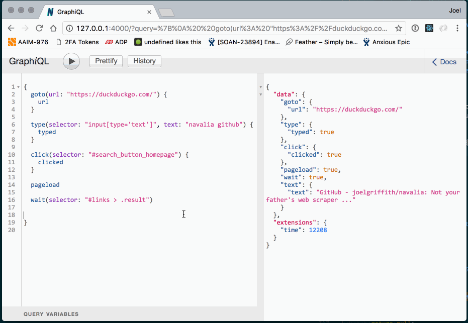

[](https://badge.fury.io/js/navalia)
[](https://travis-ci.org/joelgriffith/navalia)
[](https://david-dm.org/joelgriffith/navalia)
[](https://github.com/prettier/prettier)

The bullet-proof, fast, and most feature-rich Chrome driver around. Navalia lets you interact with Chrome and run parallel work with ease. Not using JavaScript? There's a GraphQL server that you can use to communicate with over HTTP allowing any runtime to drive Chrome.

[View the library documentation here](https://joelgriffith.github.io/navalia/)
[Looking for test inspiration? Navalia uses itself for tests.](./integration/api.test.ts)

## Features

- Scrape webpage data, even from JavaScript-heavy sites.
- Run automated functional tests.
- Discover visual regressions in your site.
- Capture screenshots, pdfs, execute javascript, insert text, and more.
- The largest API for interacting with Chrome.

## GraphQL Front-end

Simply run `navalia` with a specified port e.g.

```bash
$ npm i -g navalia
$ navalia --port 4000
```



## Recipes

- [Functional Testing](https://codeburst.io/composable-end-to-end-tests-for-react-apps-2ec82170af62)

- [Website Code Coverage](https://codeburst.io/capturing-unused-application-code-2b7594a9fe06)

- [Visual Regression Testing](https://codeburst.io/automatic-visual-regression-testing-23cc06471dd)

## Usage

The API for interacting with a browser is simple and chainable. You can call all methods individually and `await`/`then` the resulting value, or chain multiple together and collect their responses in a single result.

*Chaining*

```js
const { Chrome } = require('navalia');
const chrome = new Chrome();

chrome
  .goto('https://amazon.com')
  .type('input', 'Kindle')
  .click('.buy-now')
  .end()
  .then((responses) => {
    console.log(responses); // ['https://www.amazon.com/', true, true, true]
  });
```

*Await*

```js
import { Chrome } from 'navalia';
const chrome = new Chrome();

async function buyItOnAmazon() {
  const url = await chrome.goto('https://amazon.com');
  const typed = await chrome.type('input', 'Kindle');
  const clicked = await chrome.click('.buy-now');

  chrome.done();

  console.log(url, typed, clicked); // 'https://www.amazon.com/', true, true
}

buyItOnAmazon();
```

## Roadmap

In no particular order, this is the vision of navalia going forward:

- [X] Expanded browser API (pdf rendering, network watching, more).
- [ ] Bring more vendors onto the framework.
- [ ] Better typings around externals with no @type support.
- [X] Parameterization on killing long-running jobs.
- [ ] Unit testing all features.
- [ ] Integration testing with the various vendors so our API's don't break when theirs do.
- [X] Travis, coveralls, greenkeeper, and other handy-dandy tools to automate chore tasks.
